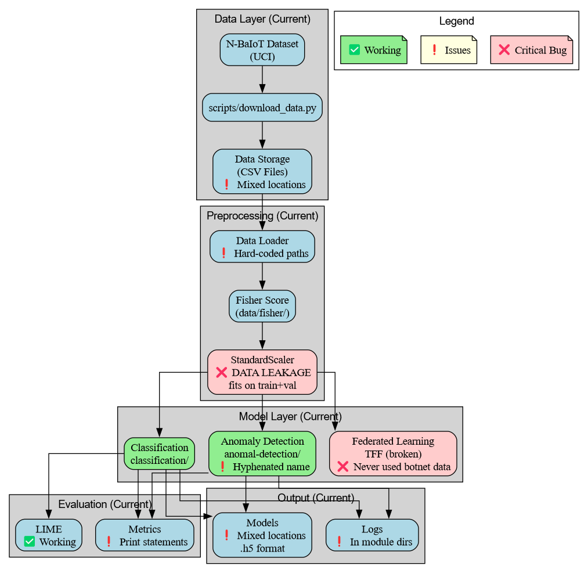
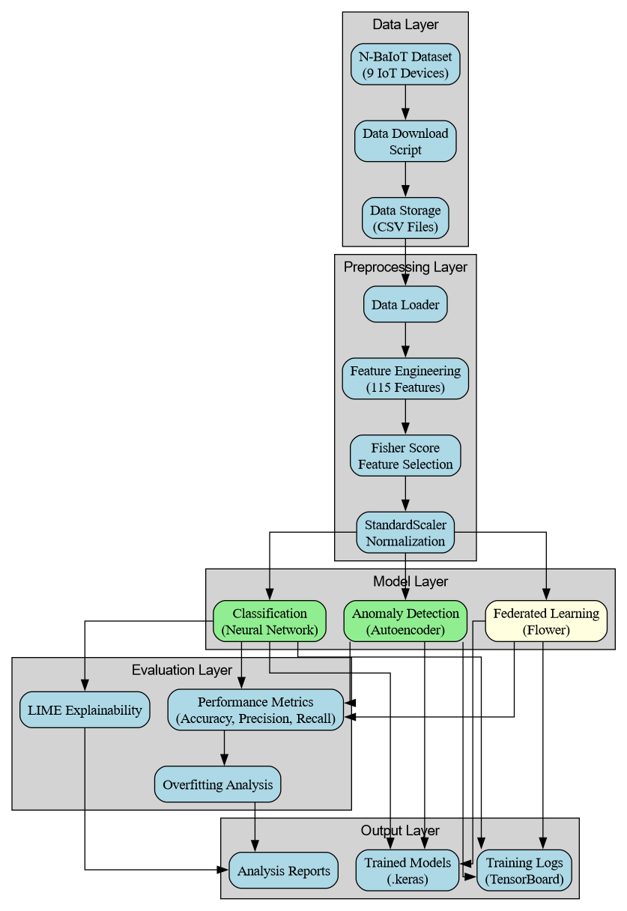
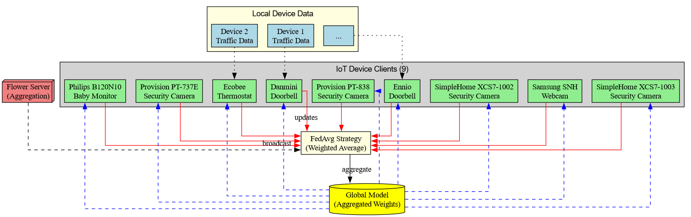

# IoT Botnet Traffic Analysis with Federated Learning

<div align="center">

[](https://github.com/iAmGiG/BotnetTrafficAnalysisFederaedLearning)
[](#architecture)
[](https://www.python.org/)
[](https://www.tensorflow.org/)
[](https://keras.io/)
[](https://flower.ai/)
[](LICENSE)

[](https://www.sciencedirect.com/science/article/pii/S2666827022000081)
[](https://digitalcommons.kennesaw.edu/cgi/viewcontent.cgi?article=1044&context=cs_etd)
[](https://archive.ics.uci.edu/ml/machine-learning-databases/00442/)

[-brightgreen?style=flat-square&logo=checkmarx&logoColor=white)](#key-results)
[](#architecture)
[](#architecture)

</div>

---

> **✅ This is the `main` branch** - Production-ready implementation with critical bug fixes and validated results. For the original 2020 research code, see the [`archive-2020-research`](https://github.com/iAmGiG/BotnetTrafficAnalysisFederaedLearning/tree/archive-2020-research) branch.

---

## Published Research

**Title**: *Detecting, Classifying and Explaining IoT Botnet Attacks Using Deep Learning Methods Based on Network Data*

**Published Papers**:

- [ScienceDirect (Journal Publication)](https://www.sciencedirect.com/science/article/pii/S2666827022000081)
- [Kennesaw State University Digital Commons (Thesis)](https://digitalcommons.kennesaw.edu/cgi/viewcontent.cgi?article=1044&context=cs_etd)

**Institution**: Kennesaw State University, Department of Computer Science
**Year**: 2020-2022

---

## Project Overview

This project demonstrates that deep learning models can effectively detect and classify IoT botnet attacks using network traffic data in a device-agnostic manner. Two complementary approaches are implemented:

### 1. **Anomaly Detection** (`anomaly-detection/`)

- **Approach**: Autoencoder-based deep learning
- **Goal**: Detect malicious vs. benign traffic
- **Method**: Learn normal traffic patterns, flag deviations as attacks
- **Dataset**: Trained on benign traffic, tested against Mirai and Gafgyt attacks

### 2. **Classification** (`classification/`)

- **Approach**: Multi-class neural network classifier
- **Goal**: Classify attack types (benign, Gafgyt, Mirai)
- **Results**: **99.98% accuracy** with all features, **99.9%** with top 3 features
- **Method**: Supervised learning with labeled attack data

### 3. **Federated Learning** (Experimental)

- **Status**: Research/experimental - simulation-based, not production
- **Implementation**: TensorFlow Federated (TFF) simulation
- **Latest**: `anomaly-detection/train_v04.py`, `run_experiment_*.py`
- **Note**: Experimental attempts archived in `docs/archived/experimental/`

---

## Architecture

### System Architecture Overview

**Current System (2020)**:
<div align="center">

<p><em>Figure 1: Current system architecture showing the 2020 implementation with identified issues (data leakage, broken TFF, hard-coded paths)</em></p>
</div>

**Target System (2025 Modernized)**:
<div align="center">

<p><em>Figure 2: Target system architecture with modern tools (Python 3.12, TensorFlow 2.19, Flower FL, SHAP explainability)</em></p>
</div>

### Federated Learning Architecture

<div align="center">

<p><em>Figure 3: Federated learning implementation using Flower framework with 9 IoT device clients and FedAvg aggregation</em></p>
</div>

### Additional Diagrams

- **Data Pipeline**: [Current](docs/architecture/images/current/current_data_pipeline.png) | [Target](docs/architecture/images/target_data_pipeline.png)
- **File Structure**: [Current](docs/architecture/images/current/current_file_structure.png) | [Target](docs/architecture/images/target_file_structure.png)
- **Model Architectures**: [Autoencoder](docs/architecture/images/target_autoencoder_architecture.png) | [Classifier](docs/architecture/images/target_classifier_architecture.png)
- **Deployment**: [Target Architecture](docs/architecture/images/target_deployment_architecture.png)
- **Dependencies**: [Current System](docs/architecture/images/current/current_dependencies.png)

For detailed architecture documentation, see [docs/architecture/ARCHITECTURE.md](docs/architecture/ARCHITECTURE.md).

---

## Repository Structure

```bash
archive-2020-research/
├── anomaly-detection/          # Anomaly detection (autoencoders)
│   ├── train_v04.py           # Latest FL implementation
│   ├── train_og.py            # Original baseline
│   ├── test.py                # Evaluation
│   └── run_experiment_*.py    # FL experiments
├── classification/             # Multi-class classifier (99.98% accuracy!)
│   ├── train.py
│   └── test.py
├── jupyter/                    # Exploratory notebooks
├── data/fisher/                # Feature selection (Fisher scores)
│   ├── fisher.csv
│   ├── fisher2.csv
│   └── demonstrate_structure.csv
├── config/
│   └── devices.json           # 9 IoT device configurations
├── scripts/
│   └── download_data.py       # Dataset download utility
├── docs/
│   ├── archived/experimental/ # Historical FL attempts with explanations
│   └── references/
│       ├── N_BaIoT_dataset.md # Complete dataset documentation
│       ├── README.md          # Paper references
│       └── thesis.pdf         # Reference material
├── environment-archive.yaml   # Conda environment (2020 deps)
├── PYSYFT_RESEARCH.md        # FL framework analysis
└── README.md                  # This file
```

---

## Quick Start

### 1. Setup Environment

```bash
# Create conda environment (Python 3.8, TensorFlow 2.10, TFF 0.40)
conda env create -f environment-archive.yaml
conda activate botnet-archive-2020
```

### 2. Download Dataset

```bash
# Download N-BaIoT dataset from UCI repository
python scripts/download_data.py

# Manually extract .rar files to respective device folders
# Place attack CSVs in: data/{device}/gafgyt_attacks/ and data/{device}/mirai_attacks/
```

**Dataset**: [N-BaIoT on UCI](https://archive.ics.uci.edu/ml/machine-learning-databases/00442/)
**Citation**: Meidan et al., "N-BaIoT—Network-Based Detection of IoT Botnet Attacks Using Deep Autoencoders", IEEE Pervasive Computing, 2018

### 3. Train Models

**Anomaly Detection:**

```bash
cd anomaly-detection
python train_og.py              # Original centralized training
python train_v04.py             # Federated learning (simulation)
```

**Classification:**

```bash
cd classification
python train.py                 # All features
python train.py 5               # Top 5 features only
```

### 4. Evaluate

```bash
# Anomaly detection
cd anomaly-detection
python test.py

# Classification
cd classification
python test.py 5 'model_5.h5'   # Test with top 5 features
```

---

## Key Results

### Classification Performance

| Features | Accuracy | Training Time | Notes |
|----------|----------|---------------|-------|
| All 115  | 99.98%   | 42 min (20 epochs) | Best accuracy |
| Top 5    | 99.91%   | ~8 min (5 epochs)  | Fast, excellent |
| Top 3    | 99.94%   | ~8 min (5 epochs)  | Optimal balance |
| Top 2    | 84.30%   | ~8 min (5 epochs)  | Insufficient features |

**Confusion Matrix (Top 3 Features)**:

```bash
              Predicted
              Benign  Gafgyt  Mirai
Actual Benign  111439    40      6
       Gafgyt     460 566834      0
       Mirai       80    162 733501
```

### Anomaly Detection

- Threshold-based detection using MSE reconstruction error
- Trained per-device for device-specific normal patterns
- Evaluated against Mirai and BASHLITE botnet attacks

---

## Explainability

This project uses **LIME (Local Interpretable Model-agnostic Explanations)** to interpret black-box deep learning decisions:

- Generates HTML explanations for individual predictions
- Shows which features contributed to classification
- Demonstrates that DL opacity can be mitigated

---

## Federated Learning (Experimental)

### What Was Attempted

This project explored federated learning (FL) as a graduate research project at Kennesaw State University. Multiple approaches were tried:

1. **TensorFlow Federated (TFF)** - Primary approach, simulation-based
2. **PySyft** - Explored but not implemented (compatibility issues in 2020)
3. **Manual FedAvg** - Custom implementation attempt

### Current Status

- **Working**: Simulation code in `train_v04.py` and `run_experiment_*.py`
- **Limitation**: Simulation-only, not true distributed deployment
- **Note**: See `docs/archived/experimental/README.md` for full evolution history

### For Modern FL Approaches

See `PYSYFT_RESEARCH.md` for:

- Analysis of 2020 vs 2025 FL frameworks
- Recommendations for modernization
- Alternative frameworks (Flower, modern TFF)

---

## Documentation

- **Dataset**: `docs/references/N_BaIoT_dataset.md` - Complete dataset documentation with citations
- **Experiments**: `docs/archived/experimental/README.md` - Evolution of FL attempts
- **Research**: `PYSYFT_RESEARCH.md` - FL framework analysis
- **Module READMEs**: See `anomaly-detection/README.md` and `classification/README.md`

---

## Architecture

### IoT Devices (9 Commercial Devices)

1. Danmini Doorbell
2. Ecobee Thermostat
3. Ennio Doorbell
4. Philips B120N/10 Baby Monitor
5. Provision PT-737E Security Camera
6. Provision PT-838 Security Camera
7. Samsung SNH 1011 N Webcam
8. SimpleHome XCS7 1002 WHT Security Camera
9. SimpleHome XCS7 1003 WHT Security Camera

### Attack Types

- **Mirai**: TCP, UDP, ACK, HTTP, and other flood attacks
- **BASHLITE (Gafgyt)**: Various attack vectors

### Features

- **115 statistical features** extracted using AfterImage framework
- **Fisher score** feature selection for dimensionality reduction
- Damped incremental statistics on network streams

---

## Technical Stack

<div align="center">


</div>

### Dependencies (2020-era)

- Python 3.8
- TensorFlow 2.10.0
- TensorFlow Federated 0.40.0
- Pandas 1.3.5 (before `.append()` deprecation)
- NumPy 1.21.6
- scikit-learn 1.0.2
- LIME 0.2.0.1

### Known Issues

- Uses deprecated `DataFrame.append()` - works with Pandas 1.3.5
- Mixes `keras` and `tensorflow.keras` imports - works with TF 2.10
- CPU-optimized (GPU setup not guaranteed)

**Note**: The `main` branch addresses these issues with modern dependencies.

---

## Citations

### This Project

**Published Paper:**

```bibtex
@article{regan2022botnet,
  title={Detecting, Classifying and Explaining IoT Botnet Attacks Using Deep Learning Methods Based on Network Data},
  author={Regan, Christopher M.},
  journal={Computer \& Security},
  year={2022},
  publisher={Elsevier},
  url={https://www.sciencedirect.com/science/article/pii/S2666827022000081}
}
```

**GitHub Repository:**

```bibtex
@misc{regan2022github,
  title={IoT Botnet Traffic Analysis with Federated Learning},
  author={Regan, Christopher M.},
  year={2022},
  publisher={GitHub},
  howpublished={\url{https://github.com/iAmGiG/BotnetTrafficAnalysisFederaedLearning}},
  url={https://github.com/iAmGiG/BotnetTrafficAnalysisFederaedLearning}
}
```

### N-BaIoT Dataset

```bibtex
@article{meidan2018nbaiot,
  title={N-BaIoT—Network-Based Detection of IoT Botnet Attacks Using Deep Autoencoders},
  author={Meidan, Yair and Bohadana, Michael and Mathov, Yael and Mirsky, Yisroel and Breitenbacher, Dominik and Shabtai, Asaf and Elovici, Yuval},
  journal={IEEE Pervasive Computing},
  volume={17},
  number={3},
  pages={12--22},
  year={2018},
  doi={10.1109/MPRV.2018.03367731}
}
```

---

## Branch Information

**Current Branch**: `main`
**Status**: Modern, production-ready implementation
**Last Updated**: October 2024 (organization and documentation)
**Original Research Period**: 2020-2022

**Other Branches**:

- `archive-2020-research` - Original 2020 research code (preserved)
- `develop` - Original development branch (historical reference)

---

## Contact & Acknowledgments

X
**Institution**: Kennesaw State University
**Lab**: CCSE, DSL Laboratory
**Original Supervisor**: Dr. Reza Parizi

**Original N-BaIoT Dataset**: Ben-Gurion University of the Negev & Singapore University of Technology and Design

---

## License

This project is licensed under the MIT License - see the [LICENSE](LICENSE)
file for details.

**Academic Research**: This work was conducted at Kennesaw State University
(2020-2022) under the supervision of Dr. Reza Parizi.

---

<div align="center">

**This is portfolio-quality research code from 2020, preserved and organized for reference.**

[](https://github.com/iAmGiG/BotnetTrafficAnalysisFederaedLearning/issues)
[](https://github.com/iAmGiG/BotnetTrafficAnalysisFederaedLearning/stargazers)

</div>
